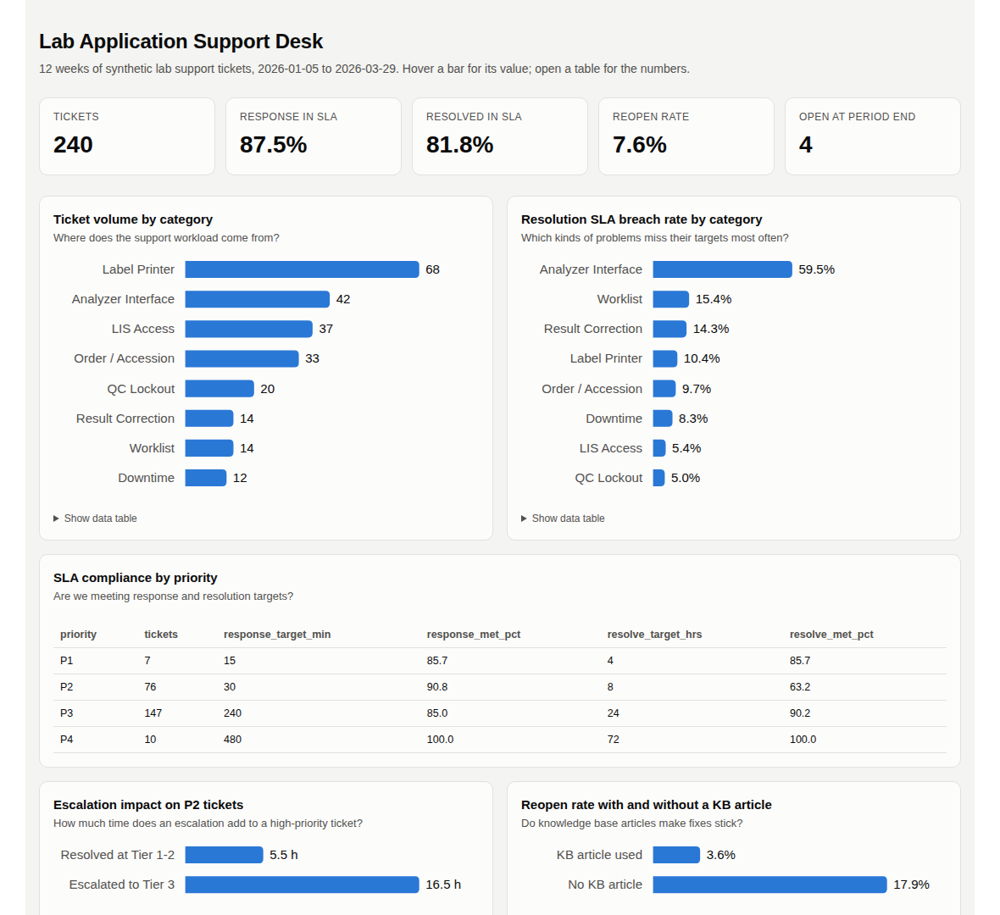

# Lab Application Support Desk


A working model of a laboratory application support desk. It includes a ticket
database, SLA reporting in SQL, a dashboard, a triage and escalation matrix,
nine knowledge base articles, and a findings write-up with recommendations.

I built it from the perspective of a Medical Laboratory Technician. These are
the problems lab staff call support about every day: label printers, account
lockouts, analyzer interfaces, missing orders, QC holds and downtime. The
project shows how I would run, measure and improve the desk that handles them.

**Live dashboard:** https://m3science.github.io/lab-support-desk/

[](https://m3science.github.io/lab-support-desk/)

> **All data is synthetic.** No real people, patients, systems or
> organizations appear anywhere in this repository.

## What's inside

| Piece | Where | What it shows |
|---|---|---|
| Ticket database | `sql/schema.sql`, `data/` | 240 tickets over 12 weeks; SLA policy; an SLA view that computes response and resolution outcomes per ticket |
| SQL reports | `sql/01_...` to `sql/09_...` | Volume, SLA by priority, breach rate by category, escalation impact, recurring issues, lockout timing, KB impact, printer hotspots, open backlog |
| Dashboard | `docs/index.html` | Summary tiles and charts built from the queries (light and dark mode, mobile-friendly) |
| Findings | [docs/FINDINGS.md](docs/FINDINGS.md) | What the data says and what I would change |
| Triage matrix | [docs/TRIAGE_MATRIX.md](docs/TRIAGE_MATRIX.md) | Priority definitions, SLA targets, escalation tiers and timing |
| Knowledge base | [kb/](kb/) | 9 vendor-neutral articles: symptoms, steps, when to escalate, what to record |

## Key findings

- **Analyzer interface tickets drive most SLA misses.** 59.5% breach resolution SLA, and 57.1% escalate to Tier 3. An escalated P2 averages 16.5 h to resolve versus 5.5 h when it stays at Tier 1-2.
- **Label printers are the largest source of volume** (28.3%). The top single issue is a *configuration* problem, "wrong default printer," concentrated at two collection sites.
- **Lockouts cluster on Monday mornings** (14 of 17), which makes a strong case for self-service password reset.
- **KB articles make fixes stick.** The reopen rate is 3.6% with an article versus 17.9% without.

Full detail and recommendations: [docs/FINDINGS.md](docs/FINDINGS.md).

## Run it

Requires Python 3.10 or newer. It uses only the standard library (SQLite is built in).

```bash
git clone https://github.com/M3Science/lab-support-desk.git
cd lab-support-desk
python -m support_desk
```

```
Built support_desk.db with 240 tickets
Ran 9 reports: 240 tickets, 81.8% resolved within SLA, 4 open.
Wrote docs/report.md and docs/index.html
```

Open `docs/index.html` in a browser for the dashboard, or see every table in
[docs/report.md](docs/report.md). To explore the data yourself, open
`support_desk.db` in any SQLite tool and query the `ticket_sla` view.

## Example query

```sql
-- Resolution SLA breach rate by category
SELECT category,
       COUNT(*)                                 AS resolved,
       SUM(1 - resolve_met)                     AS breached,
       ROUND(100.0 * (1 - AVG(resolve_met)), 1) AS breach_pct,
       ROUND(100.0 * AVG(escalated), 1)         AS escalated_pct
FROM ticket_sla
WHERE resolve_met IS NOT NULL
GROUP BY category
ORDER BY breach_pct DESC;
```

## Testing

```bash
pip install -r requirements-dev.txt
pytest -v
```

GitHub Actions runs 18 tests on every push (Python 3.10 and 3.12):
- **Data integrity:** timestamps are in order, resolved and open tickets are consistent, and every KB reference points to a real article.
- **SLA logic:** boundary cases. A ticket resolved exactly on target counts as met, one minute late is a breach, open tickets have no result, and overnight tickets are handled.
- **Reports:** all nine queries run and return data, and the report and dashboard render.
- **Findings stay honest:** every number quoted in `FINDINGS.md` is re-checked against the data, so the write-up can't drift from the queries.

## About the data

`scripts/generate_tickets.py` creates the dataset with a fixed seed, so it is the
same every run. It includes four deliberate patterns: printer volume at
collection sites, Monday lockouts, interface escalations, and higher reopen rates
without a KB article. The analysis has something real to find, and the point of
the project is the method: define the SLA, measure it in SQL, find the drivers,
recommend changes.

To regenerate everything:

```bash
python scripts/generate_tickets.py
python scripts/kb_content.py
python -m support_desk
```

## Limitations

- SLA is measured in calendar hours, not business hours.
- There is no "waiting on user" status, so all elapsed time counts against the SLA.
- It is a reporting model, not a live ticketing system.

## Related project

[lab-interface-triage](https://github.com/M3Science/lab-interface-triage) is a
Python tool that finds the HL7 result-message faults behind many of the
Analyzer Interface tickets in this dataset.

## Skills demonstrated

SQL (joins, views, CTEs, aggregation) · SLA design and measurement ·
ticket triage and escalation · knowledge base writing · root-cause and trend
analysis · data visualization · Python · automated testing · GitHub Actions
